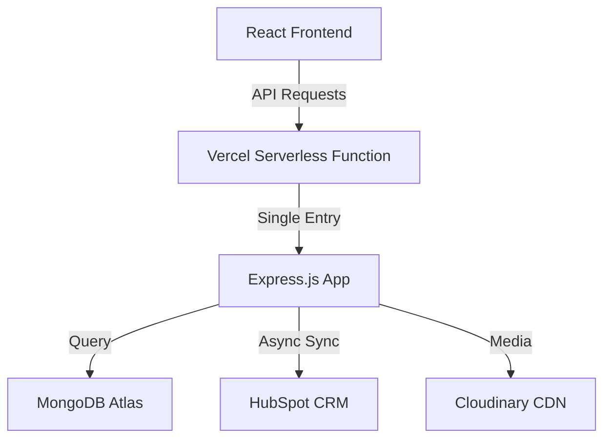

# Marketer Pro - System Architecture & Design

This document provides a high-level technical overview of the Marketer Pro platform, its core design patterns, and deployment strategies. For deeper technical specifics, please refer to the specialized guides linked at the bottom.

## 1. System Overview

Marketer Pro is a full-stack web application optimized for high-performance marketing agency workflows. It uses a **Single-Function Serverless Architecture** to remain compatible with Vercel's Hobby plan while maintaining a modular Express.js backend.

### Data Flow Diagram

## 2. Core Technical Concepts

### Underscore Folder Convention (`api/_server`, `api/_shared`)
To satisfy Vercel's **12 Serverless Function limit**, we use a single entry point at `api/index.ts`. Vercel creates one function for every file in `api/` but ignores folders starting with an underscore. This allows us to keep a modular, enterprise-grade folder structure while exposing only **one** logical function to Vercel.

### Storage Abstraction (IStorage)
The backend is built around a Repository pattern. The `IStorage` interface decoupling the API routes from the database technology, ensuring that business logic remains clean and the database implementation is swap-able.

### Bilingual & RTL Design
The platform is built with an "Arabic-First" philosophy. All CSS uses logical properties (`pe-*`, `ps-*`) to ensure that Right-to-Left (RTL) and Left-to-Right (LTR) layouts are perfectly mirros without custom CSS hacks.

## 3. Specialized Guides

For in-depth information on specific subsystems, please consult the following professional-grade documentation:

### [Server-Side Deep Dive (Express & Mongoose)](./DEEP_DIVE_SERVER.md)
*Storage patterns, database connectivity, middleware guards, and security postures.*

### [Client-Side Deep Dive (React & Vite)](./DEEP_DIVE_CLIENT.md)
*Component architecture, state management with React Query, and RTL/Bilingual implementation.*

### [API Specification (Endpoints & Responses)](./API_SPECIFICATION.md)
*Full reference for public and admin endpoints, authorization requirements, and error codes.*

### [CRM Synchronization (Hubspot Logic)](./CRM_SYNC_GUIDE.md)
*Mapping logic, de-duplication strategy, and maintenance for the HubSpot integration.*

### [SEO & Prerendering Guide](./PRERENDER_SETUP.md)
*Configuration for Prerender.io and dynamic Sitemap/Robots generation.*

---
*Maintained by the Marketer Pro Engineering Team*
