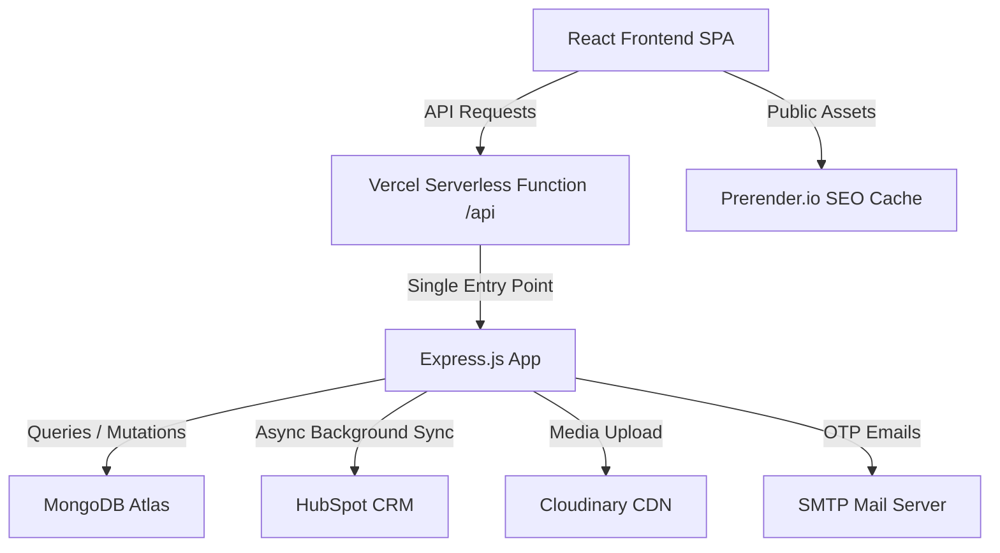

# Marketer Pro - System Architecture & Design

This document provides a high-level technical overview of the Marketer Pro platform, its core design patterns, and deployment strategies. For deeper technical specifics, please refer to the specialized guides linked at the bottom.

## 1. System Overview

Marketer Pro is a full-stack web application using a **Single-Function Serverless Architecture** to remain fully compatible with Vercel's Hobby plan while maintaining a modular, enterprise-grade Express.js backend.

### Data Flow Diagram

## 2. Core Technical Concepts

### Underscore Folder Convention (`api/_server`, `api/_shared`)
To satisfy Vercel's **12 Serverless Function limit**, we use a single entry point at `api/index.ts`. Vercel creates one function for every **file** in `api/` but ignores folders starting with an underscore. This allows a fully modular backend structure while exposing only **one** logical function to Vercel.

### Storage Abstraction (`IStorage`)
The backend is built around a **Repository pattern**. The `IStorage` interface in `api/_server/storage.ts` decouples the API route handlers from the database technology, ensuring:
- **Testability**: A mock `IStorage` implementation can be injected for unit testing without a live MongoDB connection.
- **Portability**: Switching from MongoDB to a SQL database only requires rewriting `DatabaseStorage`, not the route files.

**Pattern for adding new features:**
1. Declare the method signature in the `IStorage` interface.
2. Implement it in `DatabaseStorage` using Mongoose.
3. Access it via the exported `storage` singleton in the relevant route file.

### Feature-Based Client Architecture
The frontend uses a **feature-first** directory structure inside `client/src/features/`. Each feature (e.g., `admin`, `checkout`, `auth`) is a self-contained module with its own components, hooks, and pages. Shared, reusable UI lives in `client/src/components/` following **Atomic Design** principles (atoms → molecules → organisms → templates).

### Bilingual & RTL Design
The platform is built with an **Arabic-First** philosophy:
- The root element has `dir="rtl"` by default.
- Tailwind **logical properties** (`ps-*`, `pe-*`, `ms-*`, `me-*`) are used throughout to ensure layouts correctly mirror between RTL and LTR without custom CSS overrides.
- Text content is managed through a `useLanguage` hook backed by JSON translation files. CMS content from the database uses `{ ar: "...", en: "..." }` bilingual objects.

### CMS-Driven Content
All landing page text, images, and configuration (pricing plans, FAQs, social links, instructor data, gallery cards, etc.) is stored in MongoDB under a `SiteSetting` model and served via `/api/settings`. The Admin Settings tab provides a full in-app CMS — no code deployment is needed to update site content.

## 3. Specialized Guides

| Guide | Contents |
| :--- | :--- |
| [Server-Side Deep Dive](./DEEP_DIVE_SERVER.md) | Storage patterns, Mongoose modeling, middleware guards, and security |
| [Client-Side Deep Dive](./DEEP_DIVE_CLIENT.md) | Atomic design, React Query state, RTL/Bilingual implementation |
| [API Specification](./API_SPECIFICATION.md) | Full reference for all endpoints, auth requirements, and error codes |
| [CRM Synchronization Guide](./CRM_SYNC_GUIDE.md) | HubSpot mapping logic, de-duplication, bulk sync, and maintenance |
| [SEO & Prerendering Guide](./PRERENDER_SETUP.md) | Prerender.io setup and dynamic Sitemap/Robots generation |

---
*Maintained by the Marketer Pro Engineering Team*
